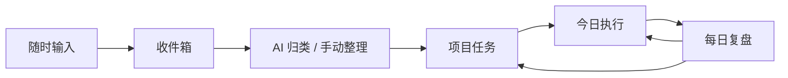
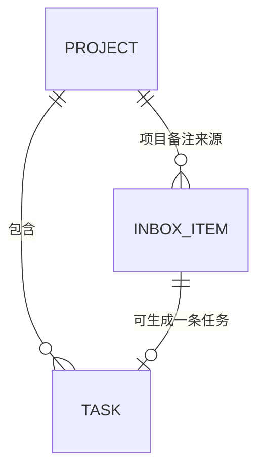

# 下一步 V1 产品需求文档

> 版本：0.1  
> 日期：2026-08-06  
> 状态：需求收敛稿  
> 用途：作为后续项目骨架开发、功能开发和验收的统一依据  

## 1. 产品背景与目标

### 1.1 产品背景

这是一个主要给自己使用的 AI 个人项目推进系统，同时用于学习 AI 应用开发。

产品不是做一个通用 Todo 工具，而是围绕一条完整闭环设计：

`输入 → 目标 → 行动 → 复盘`

V1 要解决的核心问题是：用户每天打开工作台后，能快速记录想法或任务，AI 帮助整理，整理结果变成项目和任务，最后通过今日执行和每日复盘形成持续改进的闭环。

### 1.2 产品定位

**一句话定位：一个帮助个人把零散输入转化为项目行动，并通过每日复盘保持长期推进的 AI 个人项目推进系统。**

AI 的角色是“辅助整理和执行建议”，不是“自动替用户做决定”。所有 AI 输出都必须是草稿，用户可以查看、修改和拒绝。

### 1.3 核心目标

V1 必须验证以下核心闭环：

1. 用户随时可以把想法、任务、资料记录到收件箱。
2. AI 帮助判断内容适合作为任务、项目备注、参考资料，或应忽略。
3. 用户确认后，内容可以变成项目下的任务。
4. 今日页帮助用户看到今天最重要的事。
5. 每日复盘总结当天完成情况，并给出下一步行动建议。

### 1.4 成功标准

建议以“真实使用一周”作为 V1 验收标准：

- 用户连续使用 7 天，没有遇到阻塞核心流程的问题。
- 每天至少记录 1 条收件箱内容。
- 收件箱不会长期积压，绝大多数内容会在 24 小时内被处理或明确忽略。
- 一周内完成至少 3 次每日复盘。
- 核心闭环不依赖 AI 也能手动完成。

## 2. 核心概念与通用规则

### 2.1 核心闭环

### 2.2 通用规则

- 所有新增操作都应该尽量在一页内完成，不要求用户频繁跳转。
- 所有 AI 结果都先作为草稿展示，用户确认后才写入正式业务数据。
- AI 不可用时，用户仍能手动完成收件箱处理、任务创建和复盘填写。
- 删除操作需要确认；V1 不要求复杂回收站。
- 日期以用户本地日期为准。
- V1 是单用户系统，不做注册、登录、权限和多用户数据隔离。

## 3. 用户与每日使用流程

### 3.1 目标用户

主要用户是产品作者本人：一个希望通过 AI 辅助管理个人目标、学习和工作，同时希望边做边学习 AI 应用开发的个人用户。

### 3.2 典型每日流程

| 时间 | 用户行为 | 系统支持 |
| --- | --- | --- |
| 早上 5 分钟 | 查看今日页，确定今天的 1-3 个重点任务 | 今日页展示逾期、到期、重点任务和 AI 建议 |
| 白天随时 | 想到什么就记录到收件箱 | 全局快捷输入，尽量 5 秒内完成 |
| 晚上 10 分钟 | 处理收件箱，更新任务状态 | 今日 AI 任务生成区域展示 AI 计划，支持一键生成待办 |
| 晚上 5 分钟 | 生成每日复盘 | AI 生成总结和下一步建议草稿，用户可修改后保存 |

## 4. 功能需求

### 4.1 项目管理

### 4.1.1 功能目标

把长期目标组织成项目，让任务有归属，让用户能看出项目当前是否在推进。

### 4.1.2 用户场景

1. 用户想创建“下一步”项目，并写下项目目标。
2. 用户想查看某个项目下的所有任务和当前进度。
3. 用户完成阶段性目标后，可以把项目标记为已完成或归档。

### 4.1.3 页面展示内容

**工作台已有项目区域**

- 项目名称
- 项目状态
- 当前里程碑
- 任务数量摘要
- 最近更新时间

**项目详情区域**

- 项目名称、目标、状态、当前里程碑
- 项目备注
- 项目下的任务列表
- 快捷新增任务入口

### 4.1.4 用户操作流程

1. 在工作台“已有项目”区域点击“新建项目”。
2. 输入项目名称、项目目标和当前里程碑。
3. 保存后定位到该项目，并在右侧显示项目详情。
4. 用户可以在详情区域修改目标、状态、里程碑或备注。
5. 用户可以查看该项目下所有任务。
6. 用户可以将项目标记为“进行中 / 已暂停 / 已完成 / 已归档”。

### 4.1.5 数据字段

| 字段 | 类型 | 必填 | 说明 |
| --- | --- | --- | --- |
| 项目 ID | UUID | 是 | 唯一标识 |
| 项目名称 | 文本 | 是 | 项目名称 |
| 项目目标 | 文本 | 是 | 项目希望达成的结果 |
| 项目状态 | 枚举 | 是 | 进行中、已暂停、已完成、已归档 |
| 当前里程碑 | 文本 | 否 | 用户或 AI 复盘时维护的当前重点 |
| 项目备注 | 文本 | 否 | 简单备注，不构成复杂知识库 |
| 创建时间 | 时间 | 是 | 自动生成 |
| 更新时间 | 时间 | 是 | 自动更新 |

### 4.2 任务管理

### 4.2.1 功能目标

管理所有需要执行的事项，支持归属项目、状态、优先级和日期。

### 4.2.2 用户场景

1. 用户手动创建一条任务，例如“完成 V1 项目骨架”。
2. 用户从收件箱确认 AI 建议后，生成一条项目任务。
3. 用户每天早上把某些任务标记为“今天重点”。
4. 用户完成任务后，在任务列表或今日页标记为已完成。

### 4.2.3 页面展示内容

**已有项目区域**

- 任务标题
- 所属项目
- 状态
- 优先级
- 计划日期
- 截止日期
- 完成时间

**筛选条件**

- 按项目筛选
- 按状态筛选
- 按优先级筛选
- 按日期范围筛选

### 4.2.4 用户操作流程

1. 用户从工作台已有项目区域、今日页新增任务。
2. 用户填写任务标题、备注、所属项目、优先级和日期。
3. 用户保存后，任务进入任务列表。
4. 用户可以在工作台右侧详情区域修改任务信息。
5. 用户完成任务后点击“完成”，系统记录完成时间。
6. 用户可以取消任务，取消后的任务不再进入今日建议。

### 4.2.5 数据字段

| 字段 | 类型 | 必填 | 说明 |
| --- | --- | --- | --- |
| 任务 ID | UUID | 是 | 唯一标识 |
| 任务标题 | 文本 | 是 | 简洁的行动描述 |
| 任务备注 | 文本 | 否 | 补充信息 |
| 所属项目 ID | UUID | 否 | 可为空，空表示未关联项目 |
| 状态 | 枚举 | 是 | 待办、进行中、已完成、已取消 |
| 优先级 | 枚举 | 是 | 低、中、高、紧急 |
| 计划日期 | 日期 | 否 | 计划在哪一天执行 |
| 截止日期 | 日期 | 否 | 最晚完成时间 |
| 今日重点日期 | 日期 | 否 | 标记为哪一天的重点任务 |
| 完成时间 | 时间 | 否 | 标记完成时自动生成 |
| 来源收件箱 ID | UUID | 否 | 从收件箱生成时记录来源 |
| 创建时间 | 时间 | 是 | 自动生成 |
| 更新时间 | 时间 | 是 | 自动更新 |

### 4.3 收件箱

### 4.3.1 功能目标

让用户在任何时候都能用最低成本记录想法、任务和资料，并借助 AI 完成初步整理。

### 4.3.2 用户场景

1. 用户突然想到一个想法，在今日页快速输入一句话后继续工作。
2. 用户收到一条资料链接，希望稍后决定是否转为任务或忽略。
3. 用户晚上集中处理收件箱，AI 给出归类建议，用户一键确认。

### 4.3.3 页面展示内容

**工作台输入想法区域**

- 快捷输入框
- 待处理列表
- 已处理列表
- 已忽略列表
- AI 归类建议
- 转为任务、忽略操作

每条待处理记录展示：

- 原始内容
- AI 建议所属项目
- AI 建议优先级
- AI 建议日期

### 4.3.4 用户操作流程

1. 用户在任意主要页面通过快捷输入框记录内容。
2. 内容进入收件箱，状态为“待处理”。
3. 系统调用 AI 生成归类建议，但保存内容本身不依赖 AI。
4. 用户看到建议后可以选择：
   - 确认并转为任务。
   - 忽略。
5. 处理完成后，收件箱记录进入已处理或已忽略列表。

### 4.3.5 数据字段

| 字段 | 类型 | 必填 | 说明 |
| --- | --- | --- | --- |
| 收件箱 ID | UUID | 是 | 唯一标识 |
| 原始内容 | 文本 | 是 | 用户输入的内容 |
| 来源 | 文本 | 是 | 手动输入，预留未来扩展 |
| 状态 | 枚举 | 是 | 待处理、已处理、已忽略 |
| 归类结果 | 枚举 | 否 | 任务、项目备注、参考资料、忽略 |
| 处理后的标题 | 文本 | 否 | 转为任务或备注时使用的标题 |
| 所属项目 ID | UUID | 否 | 转为项目备注或任务时记录 |
| 优先级 | 枚举 | 否 | AI 建议或用户确认的优先级 |
| 截止日期 | 日期 | 否 | AI 建议或用户确认的日期 |
| AI 建议内容 | JSON | 否 | 保存 AI 原始建议，便于修改和排查 |
| 处理时间 | 时间 | 否 | 用户处理时自动生成 |
| 创建时间 | 时间 | 是 | 自动生成 |
| 更新时间 | 时间 | 是 | 自动更新 |

### 4.4 今日页

### 4.4.1 功能目标

让用户每天打开工作台后，先看到“今天该推进什么”，而不是先面对所有历史任务。

### 4.4.2 用户场景

1. 用户早上打开工作台，查看逾期任务、今天计划任务和重点任务。
2. AI 从当前任务中建议 1-3 个今日重点。
3. 用户看到一条临时想法，直接在今日页快捷记录。
4. 用户完成重点任务后，在今日页直接标记完成。

### 4.4.3 页面展示内容

- 当前日期
- 今日重点任务
- 逾期未完成任务
- 今天计划执行的任务
- 全局快捷输入框
- AI 今日建议区
- 每日复盘入口

### 4.4.4 用户操作流程

1. 用户打开今日页。
2. 系统展示逾期、计划日期为今天、今日重点为今天的任务。
3. 系统展示 AI 建议的重点任务，并说明建议理由。
4. 用户可以选择某条任务作为“今日重点”。
5. 用户完成任务后，在今日页标记为已完成。
6. 用户点击“进入复盘”，开始每日总结。

### 4.4.5 数据字段

今日页本身不新增数据表，使用任务表中的以下字段：

- `计划日期`：是否等于今天
- `截止日期`：是否早于今天且未完成
- `今日重点日期`：是否等于今天
- `状态`：是否未完成

### 4.5 AI 能力

### 4.5.1 功能目标

V1 只做三种基础 AI 能力，不做 Agent、多模型协作、RAG 或复杂自动化：

1. 收件箱归类建议。
2. 今日重点任务建议。
3. 每日复盘草稿生成。

### 4.5.2 收件箱归类建议

**输入**

- 收件箱原始内容
- 当前已有项目名称和项目目标

**输出**

- 内容分类：任务、项目备注、参考资料、忽略
- 建议标题
- 建议所属项目
- 建议优先级
- 建议日期

**规则**

- AI 不能直接创建项目，只能建议项目名称。
- 用户确认后才能生成任务或写入项目备注。
- 如果 AI 建议的项目不存在，系统提示“新建项目”作为候选。

### 4.5.3 今日重点任务建议

**输入**

- 今天计划执行的任务
- 逾期任务
- 当前进行中的项目
- 各任务优先级和截止日期

**输出**

- 建议的 1-3 个今日重点任务
- 每条建议的简要理由

**规则**

- AI 建议只是草稿，用户可以选择接受、忽略或手动标记其他任务为重点。

### 4.5.4 每日复盘草稿生成

**输入**

- 当天完成的任务
- 当天取消或未完成的任务
- 当天新增或处理过的收件箱内容
- 相关项目当前状态

**输出**

- 当天完成情况总结
- 未完成或延迟事项
- 明天建议执行的 1-3 件事

**规则**

- 复盘草稿必须可编辑。
- 用户保存后成为正式复盘记录。
- AI 调用失败时，用户仍可以手动填写复盘。

### 4.5.5 AI 输出存储

AI 能力不单独建立复杂 AI 表。相关结果存储在：

- 收件箱的 `AI 建议内容` 字段。
- 复盘表的 `总结` 和 `下一步建议` 字段。

### 4.6 复盘页面

### 4.6.1 功能目标

让每日复盘足够轻，用户能在 5 分钟内完成，并留下可回溯的每日记录。

### 4.6.2 用户场景

1. 用户晚上打开复盘页，选择今天的日期。
2. 用户点击“生成 AI 草稿”。
3. 用户查看 AI 总结和下一步建议，手动修改后保存。
4. 用户稍后可以回看过去某天的复盘。

### 4.6.3 页面展示内容

- 日期选择器
- 生成 AI 草稿按钮
- 当天总结编辑区
- 下一步建议编辑区
- 保存按钮
- 历史复盘列表

### 4.6.4 用户操作流程

1. 用户进入复盘页。
2. 默认选中今天。
3. 用户点击“生成 AI 草稿”。
4. 系统展示总结和下一步建议草稿。
5. 用户修改后点击保存。
6. 系统保存复盘记录，并回到历史列表。

### 4.6.5 数据字段

| 字段 | 类型 | 必填 | 说明 |
| --- | --- | --- | --- |
| 复盘 ID | UUID | 是 | 唯一标识 |
| 复盘日期 | 日期 | 是 | 每天唯一 |
| 当天总结 | 文本 | 是 | 用户保存后的正式总结 |
| 下一步建议 | 文本 | 否 | 明天建议，每行一条 |
| 状态 | 枚举 | 是 | 草稿、已保存 |
| 创建时间 | 时间 | 是 | 自动生成 |
| 更新时间 | 时间 | 是 | 自动更新 |

## 5. 页面结构

V1 只保留 3 个一级导航页面。

| 页面 | 路由建议 | 核心内容 |
| --- | --- | --- |
| 日历 | `/` | AI 任务生成、今日待办 |
| 书桌 | `/workspace` | 项目树、项目详情、任务新增/修改/完成 |
| 抽屉 | `/review` | 生成复盘、编辑、保存、历史记录 |

今日页保留“AI 任务生成”和“今日待办”两个区域，项目页负责管理项目和任务。

V1 不设用户注册登录页面；AI API Key 通过本地环境变量配置，不在浏览器中保存。

## 6. 数据库设计

### 6.1 实体关系

说明：

- 一个项目可以包含多条任务。
- 一个项目可以关联多条收件箱记录，主要用于“项目备注”来源追溯。
- 一条收件箱记录最多生成一条任务。
- 一条任务可以不属于任何项目，但建议用户尽量归属项目。
- 复盘记录通过任务完成日期查询当天任务，不单独建立复杂关联表。

### 6.2 通用字段约定

- `id`：主键，UUID 或等效文本主键。
- `created_at` / `updated_at`：自动创建和更新时间。
- 日期字段使用 `DATE`。
- 时间字段使用 `DATETIME`。
- 枚举字段在 SQLite 中使用 `TEXT`，在代码层限制合法值。
- 文档中的类型是通用 SQL 表示，最终实现允许按 SQLite/PostgreSQL 微调。

### 6.3 projects 表

| 字段 | 类型 | 必填 | 约束 | 说明 |
| --- | --- | --- | --- | --- |
| id | UUID | 是 | 主键 | 项目唯一标识 |
| name | TEXT | 是 | 非空 | 项目名称 |
| objective | TEXT | 是 | 非空 | 项目目标 |
| status | TEXT | 是 | 枚举 | active、paused、completed、archived |
| current_milestone | TEXT | 否 | - | 当前里程碑 |
| notes | TEXT | 否 | - | 简单项目备注 |
| created_at | DATETIME | 是 | - | 创建时间 |
| updated_at | DATETIME | 是 | - | 更新时间 |

### 6.4 tasks 表

| 字段 | 类型 | 必填 | 约束 | 说明 |
| --- | --- | --- | --- | --- |
| id | UUID | 是 | 主键 | 任务唯一标识 |
| title | TEXT | 是 | 非空 | 任务标题 |
| notes | TEXT | 否 | - | 任务备注 |
| project_id | UUID | 否 | 外键 projects.id | 所属项目，可空 |
| status | TEXT | 是 | 枚举 | todo、in_progress、done、cancelled |
| priority | TEXT | 是 | 枚举 | low、medium、high、urgent |
| scheduled_date | DATE | 否 | - | 计划执行日期 |
| due_date | DATE | 否 | - | 截止日期 |
| focus_date | DATE | 否 | - | 标记为某日重点 |
| completed_at | DATETIME | 否 | - | 完成时间 |
| inbox_item_id | UUID | 否 | 外键 inbox_items.id，唯一 | 来源收件箱记录 |
| created_at | DATETIME | 是 | - | 创建时间 |
| updated_at | DATETIME | 是 | - | 更新时间 |

### 6.5 inbox_items 表

| 字段 | 类型 | 必填 | 约束 | 说明 |
| --- | --- | --- | --- | --- |
| id | UUID | 是 | 主键 | 收件箱记录唯一标识 |
| content | TEXT | 是 | 非空 | 原始内容 |
| source | TEXT | 是 | - | 来源，V1 默认 manual |
| status | TEXT | 是 | 枚举 | inbox、processed、ignored |
| category | TEXT | 否 | 枚举 | task、project_note、reference、ignore |
| title | TEXT | 否 | - | 处理后的标题 |
| project_id | UUID | 否 | 外键 projects.id | 关联项目 |
| priority | TEXT | 否 | 枚举 | low、medium、high、urgent |
| due_date | DATE | 否 | - | 建议截止日期 |
| ai_suggestion_json | JSON | 否 | - | AI 原始建议 |
| processed_at | DATETIME | 否 | - | 处理时间 |
| created_at | DATETIME | 是 | - | 创建时间 |
| updated_at | DATETIME | 是 | - | 更新时间 |

### 6.6 reviews 表

| 字段 | 类型 | 必填 | 约束 | 说明 |
| --- | --- | --- | --- | --- |
| id | UUID | 是 | 主键 | 复盘唯一标识 |
| review_date | DATE | 是 | 唯一 | 复盘日期 |
| summary | TEXT | 是 | 非空 | 当天总结 |
| next_actions | TEXT | 否 | - | 下一步建议，每行一条 |
| status | TEXT | 是 | 枚举 | draft、final |
| created_at | DATETIME | 是 | - | 创建时间 |
| updated_at | DATETIME | 是 | - | 更新时间 |

## 7. V1 明确不做的内容

- 复杂知识库：V1 只保留项目备注和收件箱“参考资料”状态，不做 Wiki、标签体系、全文检索。
- 多 Agent 系统：V1 只有单次模型调用的基础 AI 能力。
- 自动新闻抓取：V1 不连接外部信息源，不做自动采集。
- 移动端：V1 只做桌面端优先的响应式 Web 页面。
- 多用户和权限系统：V1 是单用户系统。
- 登录注册：V1 本地使用不实现账号体系。
- 日历同步：不接入 Google Calendar、Outlook 等外部日历。
- 提醒通知：不做邮件、短信、浏览器或系统推送。
- 重复任务：不支持按规则自动生成周期任务。
- 复杂统计报表：不做可视化数据分析。
- 浏览器插件、语音输入、第三方集成和自动化工作流。

## 8. 开发顺序与验收标准

以下阶段默认在 PRD 确认后开始。

| 阶段 | 开发内容 | 验收标准 |
| --- | --- | --- |
| 1. 项目骨架 | 初始化 Next.js 项目、基础导航、数据库连接、数据表 | 本地能启动，3 个一级页面可跳转，数据库迁移成功 |
| 2. 项目与任务 | 工作台项目树、项目详情区域、项目 CRUD、任务 CRUD | 能创建项目，能创建并修改任务，任务显示在项目下 |
| 3. 收件箱 | 快捷输入、待处理列表、原内容直接转为任务、忽略 | 能记录一条内容，并能手动处理为任务或忽略 |
| 4. 今日页 | 逾期、计划任务、今日重点、快捷输入、任务完成 | 今日页能正确展示今天需要处理的任务，并能完成任务 |
| 5. AI 能力 | 收件箱归类、今日重点建议、复盘草稿生成 | 三个 AI 入口都能生成可编辑草稿；AI 失败时手动流程仍可用 |
| 6. 复盘与收尾 | 复盘编辑、保存、历史、界面打磨、数据备份、部署 | 能保存并查看每日复盘；连续使用一周核心流程无阻塞 |

### 8.1 最终验收路径

从收件箱输入一条想法，AI 建议归类，确认后变成某个项目下的任务，在今日页完成该任务，最后生成并保存每日复盘。

这条路径完整跑通，且 AI 不可用时仍能手动完成，即视为 V1 核心目标达成。

## 9. 后续可扩展方向

以下内容不在 V1 范围，但可以作为后续迭代方向：

- 每周复盘。
- 周目标拆解。
- 重复任务。
- 标签和更细的资料管理。
- 统计报表。
- 移动端或 PWA。
- 外部日历同步。
- 更复杂的 AI 建议和自动化。
